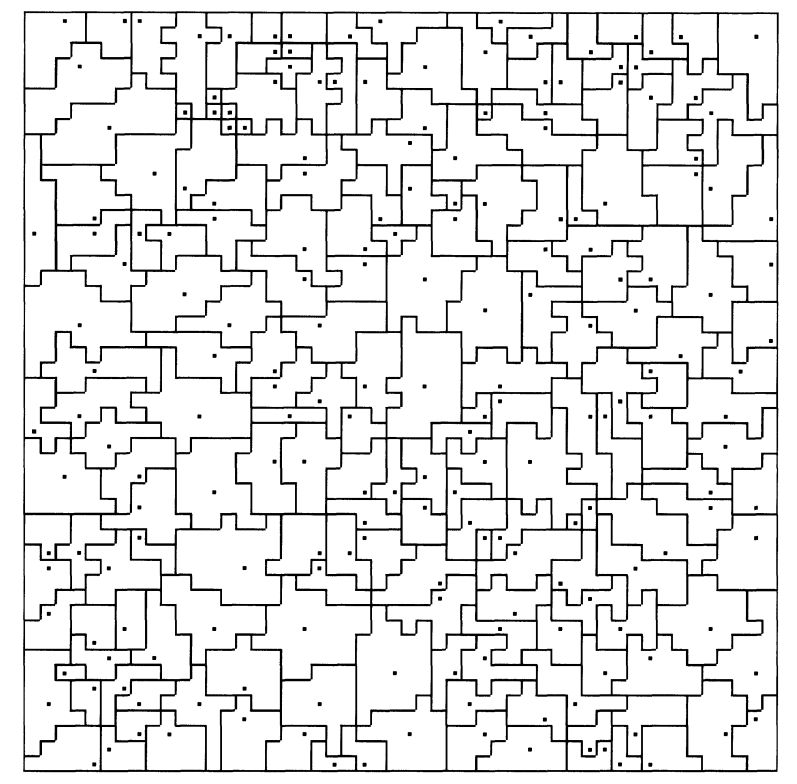
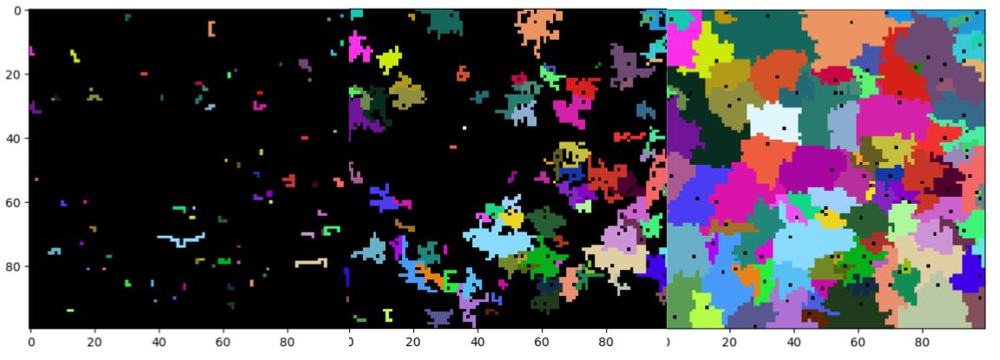
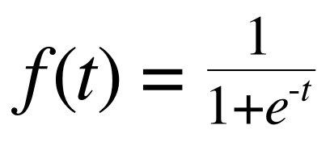
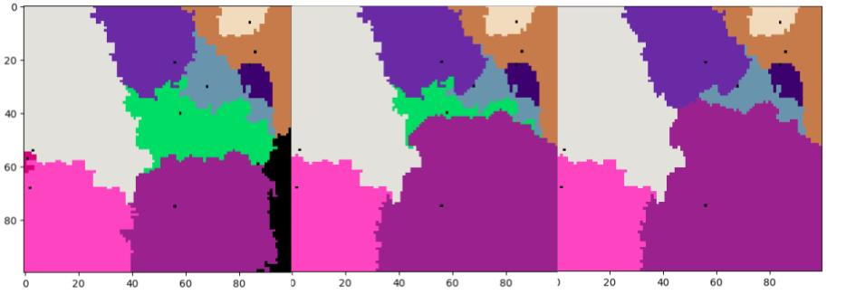
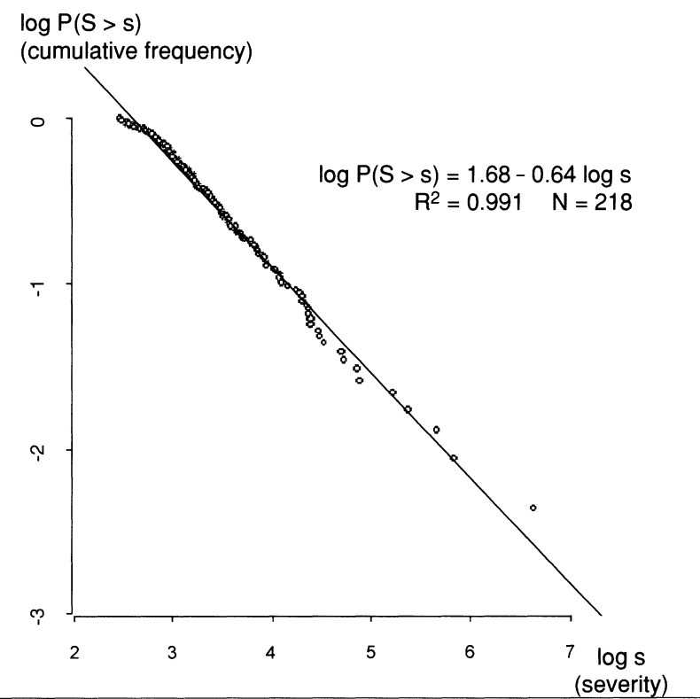
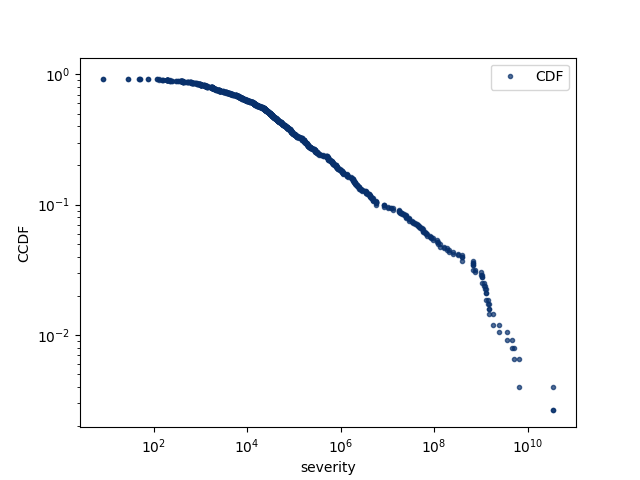
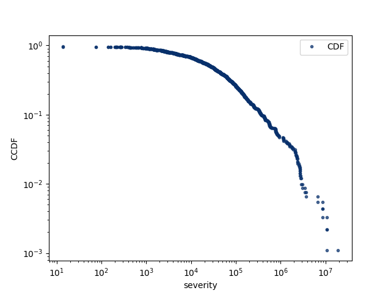

# Agent-Based Simulation of State Formation and Wars
## Nick Steelman and Seungin Lyu

### Abstract

Lewis Richardson, in his post-WWII paper in 1945, reported that the severity of wars follows a power law distribution [3]. Almost 70 years later, we find the exact reasons behind this observation still not well understood.
Cederman tackles the problem with an agent based model and replicated the power law distribution first reported by Richardson [1]. Inspired my Cederman's agent based model, we design and implement a similar model to discover whether it is sufficient to reproduce the same power-law graph with different key concepts including sigmoid function based declaration of wars and resource-based decisions to wage war. Our model produces either a log-normal or log-log distribution depending on the given parameters. We illustrate that the tuning the <i>advantage</i> threshold that affects the probability of attacking yields a log-log distribution. Thus we conclude that the conditions deciding when a country attacks contribute to the power-law distribution of wars.

### Motivation
Richardson in 1945, reported that the severity of all wars follows a power law distribution [3]. Cederman attempted to explain this phenomenon by proposing an agent-based model of war and state formation called GeoSim that illustrates the power-law nature of the severity of wars. He suggested that the scale-free behavior of his model depends on "a process of technological change that leads to contextually dependent, and stochastic decisions to wage war" [3].

In his model, the process of technological change is represented as "a shift of loss-of-strength gradient" which defines the amount of resource a country can "tax" from a province depending on the province's distance from the capital. So as the technology advances, a country can extract more tax from distant provinces. By "contextually dependent decision to wage war", he means that a country is more likely to enter a war if its neighbors are at war. By "stochastic decisions to wage war", he means that there exist fixed non-trivial probability parameters associated with a country either entering or stopping a war.

Inspired by Cederman's model, we design and propose a new agent-based model that partially adopts concepts from Cederman's model including the concept of capitals and provinces and the concept of distance-dependent taxation. We interpret "the contextually dependent and stochastic" decisions to wage war differently and implement a model that depends heavily on the amount of resource available to determine the decisions to wage war and the results of the wars. With our model, we seek to find answer to the following questions : How do wars start and spread? Can we replicate the power-law distribution of wars?

### Model Description
Our model consists of three discrete phases : the state formation phase, the preparation phase, and the war phase.

In the state formation phase, we initialize a `n x n` grid. We define each cell on the grid as a province. Then we initialize `m` countries. To each country, we assign a random capital position on the grid and a random expansion rate `P_expansion` between 0.2 and 0.4 . After the random allocation of capitals, we expand each country by expanding the border provinces. By border provinces, we mean the outermost provinces of a country. At each time step, a border province expands and claims its unoccupied neighboring provinces on the grid (left, right, top, bottom) with the probability `P_expansion` of the country. We repeat this expansion process until there are no unoccupied provinces left on the grid as shown in Figure 2. This gradual expansion of countries is substantially different from the Cederman model in which all countries are initialized on the grid with predefined territories as shown in Figure 1.

 </img>

Figure 1. The grid of Cederman's phase after the initialization. Each country is surrounded by puzzle-like boundaries and the black dots represent the capitals. [3]

  

 </img>

Figure 2. (left, middle) :  The grid during the initialization phase. (right) : The grid after the initialization phase. The black dots represent the capitals. The layout of the countries with unique colors roughly matches that of tightly packed countries on a real map.*

 
 

Once all the provinces are claimed by the countries, we initialize resources. Each province is given an initial resource that depends on its distance from the capital. We define
`(MaxPossibleDistance - DistanceFromCapital / MaxPossibleDistance )^2`
as the amount of the initial resources allocated to each province. This definition of resources illustrates the property that provinces closer to the capital get more resources while provinces far away from the capital get less resources. This idea is also present in the Cederman model, but implemented with a variable amount of taxation dependent on the time since the model started, in order to represent increased taxation due to the advancement of technology.

Then, we define `TotalRes`, the total amount of resources of a country, as the sum of all the resources of the provinces that belong to that country. At the end of this state formation phase, we evenly distribute `TotalRes` among the border provinces that face enemy provinces. In short, we allocate the resources only to the border provinces because only the border provinces directly affect the decisions to wage war and the war results.

For each step in the preparation phase, each country first looks at how much resource each enemy country has placed against it at the country level. We define this quantity as the sum of all enemy resources around each individual border province of the country. Then we update the resource of each border province with `(total amount of enemy resource against this province / sum of enemy resources) * TotalRes`. If a country was at war in the previous step, then we allocate more resources proportional to the resource differences between the warring provinces so that a losing province gets supported with more resources. This step also deviates from the original paper, where allocation of resources base depend solely on strength of enemy borders.
 
Figure 3 shows the resource allocation along the borders after the initialization phase. Provinces on the inside of the country are allocated no resources while the borders of the country are allocated resources according to the strength of the opposing enemies.
 

 </img>

Figure 3. Grid with resource allocated at each border province after the initialization phase. Black indicates no resources while white indicates the allocated resources.

 
 

After all countries have allocated their resources, the war phase begins. In the war phase, if two countries were previously at war with each other, then they decide whether to declare peace-treaty by using a sigmoid function:
 

 </img>

where `t = TotalResources / Total Damage done in this War - Crossover`. `Crossover` is a tuned parameter that dictates when a country is equally likely to cut it's losses and keep fighting. If the peace-treaty is declared, we end the war and record the total war damage to plot the cumulative distribution of the severity of wars.

Then each country declares war by looking at the resources at the country level. The probability of declaring a war depends on a similar sigmoid function that uses `TotalRes against an enemy / TotalEnemyRes against this country - Advange`. `Advantage` is a tuned threshold parameter dictating how much more powerful a country must be before it is most likely to declare war.

Then each province wages war at the microscopic level, again using the same sigmoid function with `t = TotalResAttcking / TotalResDefending - Advange`. If a province wins a battle, it continues to wage battles with the same sigmoid function. If a province runs out of resources, then the province is taken by the victorious country. Note that a country enters the state of anarchy when its capital is taken away and immediately sets all the resources belonging to that country zero. Figure 4 illustrates this dynamic process.

 </img>

Figure 4. The purple country expands and takes the capital of the green country, causing the green country to collapse and gets taken over by all its neighbors.

### Interpreting Results

Figure 5 shows the power law distribution discovered by the originally Richardson paper. The Cederman paper validates its model through reproduction of this graph shown in *Figure 6*.

 </img>

Figure 5. (left) The distribution of wars on a log-log scale with frequency and severity from Richardson [1] (right) The distribution of wars from an updated record of wars accumulated until 1997. [3].

 

 </img>

Figure 6. The simulated cumulative frequency distribution generated from Cederman's model [3]

 </img>

Figure 7. The simulated complementary cumulative  distribution of frequency war severity generated from our model. Note that the maximum severity is in the range of 10^10 which is substantially greater than that of Figure 6 (10^7).

 

Similarly, we validate our own model by replicating the previously reported power-law distribution of wars shown in Figure 5 and Figure 6. As shown in Figure 7, we qualitatively replicate the log-log distribution, although the slope at the tail in our plot is steeper. While the two plots do partially match quantitatively, we find that the maximum war severity in our model is greater than in Cederman's model. We believe that this quantitative difference comes from the arbitrary choices we made for our parameters.
 
 
We discover that the majority of parameters in our model do not substantially effect the observed distribution.
Varying parameters such as the size of the board and number of actors does not change the distribution.
 
The pertinent parameter to the model turns out to be the sigmoid function that determines when countries declare war and when they attack. As mentioned earlier,
the variable `Advantage` dictates how strong a country should be to be able to attack and take over its neighbors. For the log-log graph `Advantage` was set to 2.3 (i.e. a country is more likely than not to attack a neighbor when it is 2.3 times stronger) but as it varies, so does the distribution. If it is decreased to 2, countries are more likely to attack earlier; therefore more smaller countries will fight to the death earlier. This leads to no state of equilibrium and one super-country to take over the whole board. With a large amount of mid-size battles, the log-log distribution changes to something more akin to log-normal.

 </img>

Figure 8. The simulated cumulative frequency distribution generated from our model with large `Advantage` value. The distribution looks more log-normal than log-log.

 
Alternatively when `Advantage` is set too high, countries will not attack unless they have a very significant advantage over their neighbor. This leads either to the larger initial countries slowly taking over all their neighbors as the rest weight in fear, or to a quick steady state without much fighting.

### Conclusion

We take the incredibly complex interactions of war and simplify them down into an agent-based model. We find that there are many design choices that are equally viable for modeling purposes. We re-implement Cederman's model, making substantially different decision while keeping his model's property of having contextually dependent, and stochastic decisions to wage war. Despite the large disparity in implementation, we see similar results. We find that the essential part of our model is the parameters deciding when a country attacks and wages war, with the majority of other parameters playing extraneous roles. This conclusion is consistent with those drawn from the Cederman paper, implying war and battle decisions play a key role in the observed power-law war distribution observed.

For future steps, we suggest the verification of our country initialization algorithm on a grid by comparing the layout to actual maps of countries. We also suggest exploring the concept of alliance and check if adding alliances yields steady end-states as observed in the real world.

### Annotated Bibliography

#### 1. Modeling the size of wars : from billard balls to sandpiles

Cederman, L. E. (2003). Modeling the size of wars: from billiard balls to sandpiles. American Political Science Review, 97(1), 135-150.

To answer why the casualty levels of wars are power-law distributed as shown in Richardson's discovery, Cederman proposed an agent-based model of war and state formation called GeoSim that replicates the empirically expected power-law distribution. He agrees that previous models that utilize the characteristic of SOC(sand-pile, forest-fire model) do explain how wars spread, but he points out that those results do not necessarily explain how wars are initiated. His model consists of state-like agents that either fight against neighbors or don't fight over allocated resources. He concludes that technological changes contribute to the decisions to wage war and that the scale-free behavior of wars depend on them.

#### 2. Fractality and Self-Organized Criticality of Wars

Roberts, D. C., and D. L. Turcotte. “Fractality and Self-Organized Criticality of Wars.” Fractals, vol. 06, no. 04, 1998, pp. 351–357., doi:10.1142/s0218348x98000407.

Roberts and Turcotte use the forest fire model to explain the power-law distribution of intensities of wars. They find there is a fractal dependence of number on intensity in which intensity is measured in terms of battle deaths. They extend the ignition of fire to the outbreak for as well as its spread. The "avalanches" in this paper are the eruptions of war that they say follow a fractal frequency-size distribution.

#### 3. Variation of the Frequency of Fatal Quarrels With Magnitude

Richardson, Lewis F. "Variation of the frequency of fatal quarrels with magnitude." Journal of the American Statistical Association 43.244 (1948): 523-546.

Richardson analyzes wars from 1820 to 1945 by classfying them according to the number of dead people. He find that that the frequency of wars with higher intensity follows a power-law distribution.
