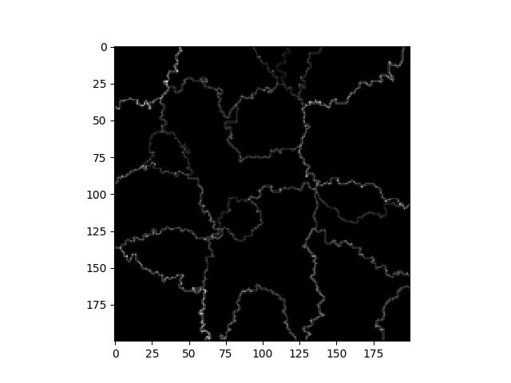

# Agent-Based Simulation of State Formation and Wars
## Nick Steelman and Seungin Lyu

### Abstract

Lewis Richardson, in his post-WWII paper in 1945, reported that the severity of wars follows a power law distribution [3]. Almost 70 years later, we find the exact reasons behind this observation still not well understood.
Cederman tackles the problem with an agent based model and replicated the power law distribution first observed by Richardson [1]. Inspired my Cederman's agent based model, we designed and implemented a similar model to discover whether it is sufficient to reproduce the same power-law graph with different key concepts including resource-based decisions to wage war and distance based taxation. Our model produce a log-normal distribution and we conclude

### Replication
Richardson in 1945, reported that the severity of all wars follows a power law distribution [3]. Cederman attempted to explain this phenomenon by proposing an agent-based model of war and state formation called GeoSim that illustrates the power-law nature of the severity of wars. He suggested that the scale-free behavior of his model depends on "a process of technological change that leads to contextually depedent, and stochastic decisions to wage war" [3].

In his model, the process of technological change is represented as "a shift of loss-of-strengh gradient" which defines the amount of resource a country can "tax" from a province depending on its distance from the capital. So as the technology advances, a country can extract more tax from distant provinces. By contextually depedent decision to wage war, he means that a country is more likely to enter a war if its neighbors are at war. By stochastic decisions to wage war, he means that there exist fixed probability values associated with a country either entering or stopping a war.

Inspired by Cederman's model, we design and propose a new agent-based model that adopts concepts from Cederman's model including the concept of capitals and provinces and the concept of distance-dependent taxation. We interpret "the contextually dependent and stochastic" decisions to wage war differently and implement a model that depends heavily on resources to decide 

Our model consists of three discrete phases : the state formation phase, the prepration phase, and the wage war phase.

contextual activation - > tax
capitals

GeoSim model consists of state-like agents on a square lattice. It illustrates the transitions between equilbria. The model draws an analogy which maps the process of technological change to the sand pile stream and maps the chains of war decisions triggered by context activation to Avalanches.
Contextual activation means increased alertness to geopolitical changes in case of conflict in a state's immediate neightborhood. Capitals can "tax" provinces and advancements in technology is modeled by shifting the tax threshold so that capital extracts more tax from distant provinces.

By implementing a similar agent-based model, we seek to find answer for the following questions : How do wars start and spread? Can we replicate the power-law distributed ?

### Interpreting Results

The figures below show the distribution of wars on a log-log scale with frequency and severity form both the original paper and an updated version through 1997. We can validate our replicated model against these results showing that its distribution of wars behaves the same way.

 </img>

The figures below show the validation from the Cederman paper along with a graphic of the states where the lines represent borders and the dots represent capitals. We should have a graphics similar to both below to show that our model produces a power law and our states seem qualitatively similar to those represented in the paper.

 </img>

These figures below show the maps of the states in our model after the initialization phase.

 </img>

 </img>

This figure below show the grids of resource allocation along the borders after the initialization phase.

 </img>

 </img>

(power law graph still needs to be replicated, we are working on it)

### Conclusion

### Annotated Bibliography

#### 1. Modeling the size of wars : from billard balls to sandpiles

Cederman, L. E. (2003). Modeling the size of wars: from billiard balls to sandpiles. American Political Science Review, 97(1), 135-150.

To answer why the casualty levels of wars are power-law distributed as shown in Richardson's discovery, Cederman proposed an agent-based model of war and state formation called GeoSim that replicates the empirically expected power-law distribution. He agrees that previous models that utilize the characterstic of SOC(sand-pile, forest-fire model) do explain how wars spread, but he points out that those results do not necesarily explain how wars are initiated. His model consists of state-like agents that either fight against neighbors or don't fight over allocated resources. He concludes that technological changes contribute to the decisions to wage war and that the scale-free behavior of wars depend on them.

#### 2. Fractality and Self-Organized Criticality of Wars

Roberts, D. C., and D. L. Turcotte. “Fractality and Self-Organized Criticality of Wars.” Fractals, vol. 06, no. 04, 1998, pp. 351–357., doi:10.1142/s0218348x98000407.

Roberts and Turcotte use the forest fire model to explain the power-law distribution of intensities of wars. They find there is a fractal dependence of number on intensity in which intensity is measured in terms of battle deaths. They extend the ignition of fire to the outbreak for as well as its spread. The "avalanches" in this paper are the eruptions of war that they say follow a fractal frequency-size distribution.

#### 3. Variation of the Frequency of Fatal Quarrels With Magnitude

Richardson, Lewis F. "Variation of the frequency of fatal quarrels with magnitude." Journal of the American Statistical Association 43.244 (1948): 523-546.

Richardson analyzes wars from 1820 to 1945 by classfying them according to the number of dead people. He find that that the frequency of wars with higher intensity follows a power-law distribution.
